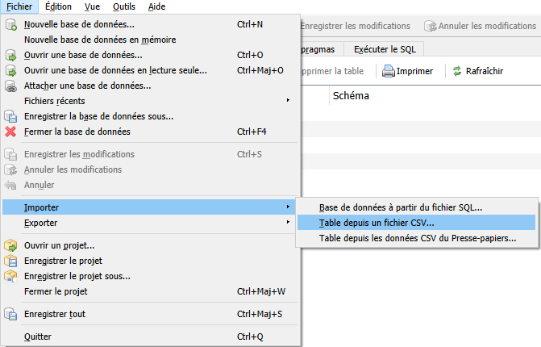
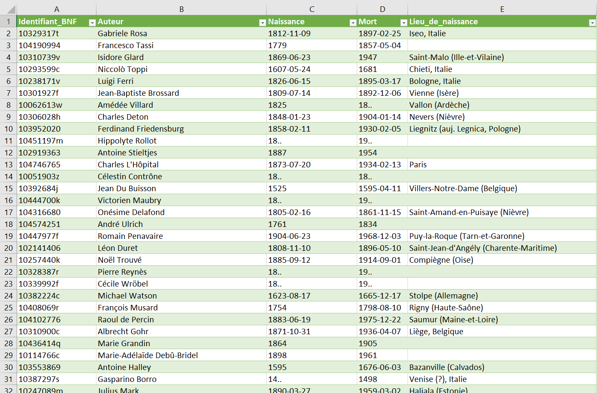
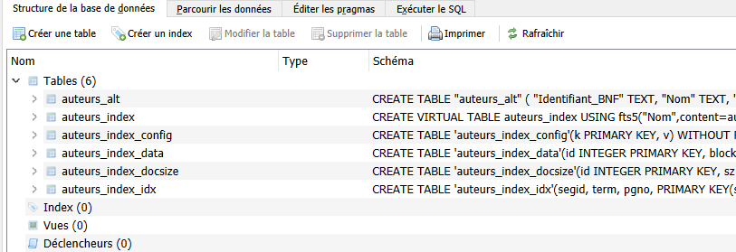
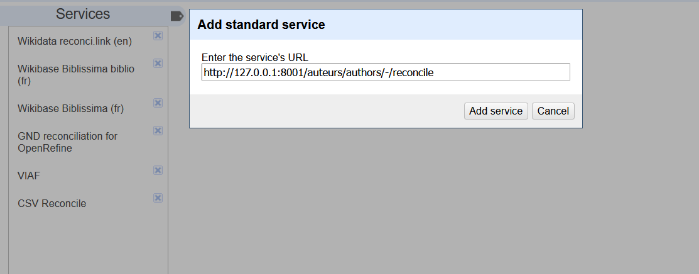
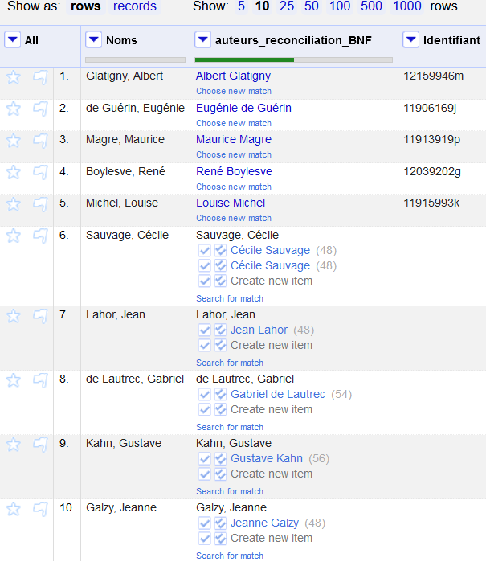

!!! warning "Attention !"
	Cette partie de la documentation ne traite pas du service de réconciliation de Biblissima+. Si c'est ce sujet qui vous intéresse, voir la page suivante : <a href="/api/api-reconciliation/">Réconcilier ses données</a>.

### 1.1 - Installation des outils
[Datasette](https://datasette.io/) est un framework open-source Python qui permet de manipuler et publier ses données avec une interface web. Cet outil donne accès à de nombreux plugins qui ajoutent de nouvelles fonctionnalités. Nous présentons ici le plugin [datasette-](https://github.com/drkane/datasette-reconcile)[reconcile](https://github.com/drkane/datasette-reconcile) qui permet la création d’un service de réconciliation des données qui suit les recommandations du W3C.

Avant de mettre en place l’outil de réconciliation, il faut d’abord installer datasette dans son environnement de travail (utilisable à partir de la version 3.9 de Python). Vous pouvez le faire en utilisant le module **pip** de Python.

```cmd
pip install datasette
```
Pour ajouter des plugins, vous devez ensuite utiliser la commande intégrée **datasette install** suivie du nom du plugin, ici **datasette-reconcile**.
```cmd
datasette install datasette-reconcile
```

Une fois ces deux commandes exécutées, il ne vous reste plus qu'à ajouter votre jeu de données et personnaliser les options de travail avec l’outil.
### 1.2 - Préparation du jeu de données
Le framework a besoin d’une base de données au format SQLite pour fonctionner. Pour créer une base dans ce format, il est tout à fait faisable de transformer un tableau CSV en fichier SQLite avec des outils comme [DB Browser](https://sqlitebrowser.org/). Une fois que vous avez créé votre nouvelle base de données (appelons-la **base\_reconcile.db**), vous pouvez importer votre fichier CSV qui va peupler cette base de données.

<figure markdown>

<figcaption>Méthode pour impoter un fichier CSV dans DB Browser.</figcaption>
<figcaption><a href="/assets/datasette/importer_csv.png">Agrandir l'image</a></figcaption>
</figure>


Vous pouvez dès à présent lancer datasette sur cette base de données. L’interface s’ouvrira sur votre navigateur à l’adresse <http://localhost:8001>.

```cmd
	datasette base_reconcile.db
```

### 1.3 - Configuration du plugin de réconciliation
Le service de réconciliation n’est pas encore configuré. Pour le faire, vous devez passer par les [fichiers de métadonnées prévus par datasette](https://docs.datasette.io/en/stable/metadata.html) au format JSON. Dans ce fichier JSON que vous allez devoir créer (ici nous l’appelerons config\_reconcile.json), vous devez spécifier l'arborescence de l’outil, en indiquant tous les niveaux de subordination jusqu’à la table qui sera prise en compte par le plugin de réconciliation. C’est au niveau de cette table que doit être configuré le plugin.

```json
{"databases":
	{"base_reconcile" (personnalisable):
		{"tables":
			{"table_reconcile" (personnalisable):
				{"plugins":
					{"datasette-reconcile":
						{"name_field":"nom_de_la_colonne" (personnalisable)
}}}}}}}
```

Vous avez ci-dessus la configuration minimale pour lancer le service.
Le **name\_field** est le seul champ obligatoire dans les métadonnées, il correspond au nom de la colonne qui sera interrogée lors de l’utilisation du service. Pour en savoir plus sur les différents outils de personnalisation du service vous pouvez les [découvrir ici](https://github.com/drkane/datasette-reconcile?tab=readme-ov-file#plugin-configuration). Les autres colonnes de la base de données, en dehors du **name_field**, peuvent être accessibles grâce au service <a href="/api/reconciliation-infos-techniques/#service-data-extension">data extension</a> directement intégré.

Il ne vous reste plus qu’à relancer l’application en indiquant le chemin vers votre fichier, si aucun chemin n’est indiqué, datasette récupère le fichier dans le répertoire courant.

Vous devriez maintenant pouvoir accéder à votre service de réconciliation personnalisé à partir de la page  http://localhost:8001/base\_reconcile/nom\_de\_la\_table/-/reconcile.

### 1.4 - Activer la recherche plein-texte (FTS)
L’utilisation de l’outil peut s’avérer assez limitée à cette étape de l'installation. La requête effectuée lors de la réconciliation reste sommaire, sous la forme :```%chaine\_recherchée%”```.

Pour avoir des résultats moins restrictifs et une vitesse d'exécution plus rapide, il faut configurer la table des données avec l’extension [FTS 5](https://sqlite.org/fts5.html) (Full Text Search). Deux commandes SQLite sur vos données permettent d’y parvenir. Pour exécuter ces commandes dans DB Browser ouvrez l’onglet “Exécuter le SQL”. Dans cette fenêtre, saisissez à la suite les commandes suivantes (la commande INSERT peut demander un temps d'exécution assez long en fonction de la taille de vos données).

```sql
CREATE VIRTUAL TABLE nom_index USING FTS5 (
nom_colonne_a_indexer, --tous les noms des variables
content=nom_table, --sont personnalisables
content_rowid=nom_colonne_cles);
INSERT INTO nom_index(nom_index) VALUES("rebuild");
```

La première commande permet de créer la table qui servira d’index à la recherche full text. La seconde va remplir cette table. Une fois le processus terminé, vous pouvez enregistrer et relancer datasette. Lors de la réconciliation, la vitesse de réponse est normalement plus rapide avec peut-être plus de candidats dans les options de matching. A noter que datasette-reconcile fourni également l'ensemble des services <a href="/api/reconciliation-infos-techniques/#services-suggest">suggest</a>.
### 2 - Exemple d’utilisations possibles
`	`Il est possible de récupérer n’importe quel jeu de données, le transformer en CSV, l’importer dans datasette et l’interroger à l’aide d’[OpenRefine](https://doc.biblissima.fr/api/openrefine/).

Par exemple pour réconcilier des noms d’auteurs avec les référentiels d’autorités de la BnF, on peut récupérer un de leurs jeux de données : sur la page des [dumps](https://api.bnf.fr/fr/node/270) nous avons sélectionné le dossier databnf\_org\_authors\_xml.tar.gz [lien de téléchargement](https://transfert.bnf.fr/link/2a2b3690-f642-4644-8615-9b50b59c84d9) (on peut aussi bien récupérer des données via le [SPARQL](https://api.bnf.fr/fr/sparql-endpoint-de-databnffr)).

Pour préparer le jeu de données, il faut construire une base de données avec une table contenant l’identifiant BnF et les noms d’auteurs associés. Pour l'exemple, nous avons utilisé le dump de la BnF au format [RDF/XML](https://www.w3.org/TR/rdf-syntax-grammar/).

Pour transformer le dump RDF/XML en CSV nous avons utilisé [BaseX](https://basex.org/download/) (outil qui nécessite Java 11) pour interroger l’ensemble des fichiers XML du dump avec des requêtes XQuery. La première étape est d’ouvrir dans BaseX le dossier qui contient l’ensemble des fichiers XML. Puis nous appliquons la requête suivante sur les fichiers [FOAF](http://xmlns.com/foaf/spec/) du dump afin d’extraire l’identifiant BnF (correspond à la valeur de l’attribut rdf:about), le nom des auteurs (foaf:name et, à défaut, foaf:familyName), la date de naissance (bio:birth) et de mort (bio:death) ainsi que le lieu de naissance (rdaa:P50119).

```xquery
declare namespace rdf ="http://www.w3.org/1999/02/22-rdf-syntax-ns#";
declare namespace foaf="http://xmlns.com/foaf/0.1/";
declare namespace bio="http://vocab.org/bio/0.1/";
declare namespace rdaa="http://rdaregistry.info/Elements/a/#";
declare namespace skos="http://www.w3.org/2004/02/skos/core#";
for $document in collection(databnf_person_authors_xml)
for $notice in $document/rdf:RDF/rdf:Description
where $notice/rdf:type/@rdf:resource contains text "Person"
let $identifiant := replace(replace(xs:string($notice/@rdf:about),"http://data.bnf.fr/ark:/12148/cb",""),"#about","")
let $nom :=  if ($notice/foaf:name/text() != "") then $notice/foaf:name/text() else $notice/foaf:familyName/text()
let $naissance := $notice/bio:birth/text()
let $mort := $notice/bio:death/text()
let $lieu_naissance := $notice/rdaa:P50119/text()
return $document/text()||$identifiant ||"$"||$nom||"$"||$naissance||"$"||$mort||"$"||$lieu_naissance

```

Le résultat se présente dans l’interface BaseX sous la forme d’une liste avec des valeurs séparées par des $ (c’est le séparateur choisi dans la requête). Pour sauvegarder ce résultat, il suffit de cliquer sur l'icône de sauvegarde disponible en haut à gauche de la section des résultats.


<figure markdown>

<figcaption>Résultat de la transformation en CSV.</figcaption>
<figcaption><a href="/assets/datasette/resultats_transformation.png">Agrandir l'image</a></figcaption>
</figure>

Vous pouvez choisir l’intitulé des colonnes de votre fichier CSV et l’importer, comme expliqué précédemment <sup><a href="/api/datasette/#12-preparation-du-jeu-de-donnees">1.2</a></sup>, dans la base de données SQLite FTS5.

<figure markdown>

<figcaption>Structure de la base de données avec FTS.</figcaption>
<figcaption><a href="/assets/datasette/fts_build.png">Agrandir l'image</a></figcaption>
</figure>


Pour la configuration de la réconciliation, on indique à quel champ correspond l’identifiant ciblé et comment on accède au site [data BnF](https://data.bnf.fr) à partir de cet identifiant (view\_url) afin de faciliter la vérification. Pour les besoins de la démonstration, une limite arbitraire de 10 candidats à afficher dans la fenêtre de réconciliation (max\_limit) a été fixée. Dans le fichier JSON des métadonnées, il faut nommer le service de réconciliation qu’interrogera OpenRefine (service\_name).
```json
{
"title":"Auteurs BNF",
"databases": {
  "auteurs": {
    "tables": {
      "authors": {
        "plugins": {
           "datasette-reconcile": {
            "id_field": "Identifiant",
            "name_field": "Auteur",
            "max_limit": 10,
            "view_url": "https://data.bnf.fr/fr/{{id}}",
            "service_name": "Reconciliation Persons BNF"
}}}}}}}
```

On peut désormais lancer le service datasette-reconcile et utiliser OpenRefine pour réconcilier nos données. Avec cette configuration le point d’accès se trouve à l’adresse <http://127.0.0.1:8001/auteurs/authors/-/reconcile>. C’est celle-ci qu’il faut renseigner dans OpenRefine pour ajouter le service via le bouton **Ajouter un service standard** (ou **Add standard service**) disponible dans la fenêtre de réconciliation.

<figure markdown>

<figcaption>Ajout de notre service de reconciliation dans Open Refine.</figcaption>
<figcaption><a href="/assets/datasette/ajouter_service.png">Agrandir l'image</a></figcaption>
</figure>

Il ne reste plus qu’à réconcilier ses entités auteurs avec le référentiel de la BnF, et tout cela en local ! Même s'il n’offre pas toutes les possibilités et la puissance qu’un outil de réconciliation peut avoir avec l’endpoint de Wikidata, datasette-reconcile vous permettra d’accélérer vos alignements sur des jeux de données qui ne disposent pas d’API de réconciliation.

<figure markdown>

<figcaption><a href="/assets/datasette/reconciliation.png">Agrandir l'image</a></figcaption>
</figure>

Si vous souhaitez en savoir plus, n'hésitez pas à consulter la [page GitHub](https://github.com/drkane/datasette-reconcile) de datasette-reconcile. Vous pouvez également vous plonger dans le code Python de l’application.
