OpenRefine est un logiciel libre de **nettoyage** et de **transformation de données**. Il peut être branché sur les référentiels d’autorité Biblissima pour exploiter les possibilités offertes par l’API Réconciliation via une **interface conviviale**.

!!! info "Ressources utiles"

	- Série de vidéos tutoriels pour appréhender le logiciel OpenRefine (Canal U) : [https://www.canal-u.tv/chaines/rbdd/tes-premiers-pas-avec-openrefine-0](https://www.canal-u.tv/chaines/rbdd/tes-premiers-pas-avec-openrefine-0) 

	- Documentation officielle sur la réconciliation avec OpenRefine : [https://docs.openrefine.org/manual/reconciling](https://docs.openrefine.org/manual/reconciling)


## Étape 1 - Importer des données

Ouvrir OpenRefine et importer des données. Il peut être utile de les avoir nettoyées au préalable.

<figure markdown>
  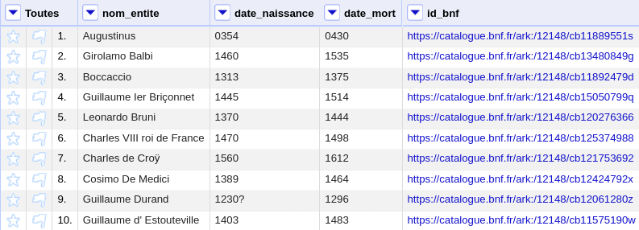
</figure>


## Étape 2 - Créer une colonne pour les données réconciliées

Pour éviter que les données d’origine soient écrasées par la réconciliation, il est conseillé de générer une nouvelle colonne comprenant un **duplicata des données à réconcilier**. 

Une flèche au-dessus de chaque colonne permet d’afficher un menu et d’interagir avec la colonne et ses données. Cliquer sur la flèche de la colonne à réconcilier, puis sélectionner « Éditer la colonne » et « Ajouter une colonne en fonction de cette colonne... ». Indiquer ensuite le nom de la nouvelle colonne.

<figure markdown>
  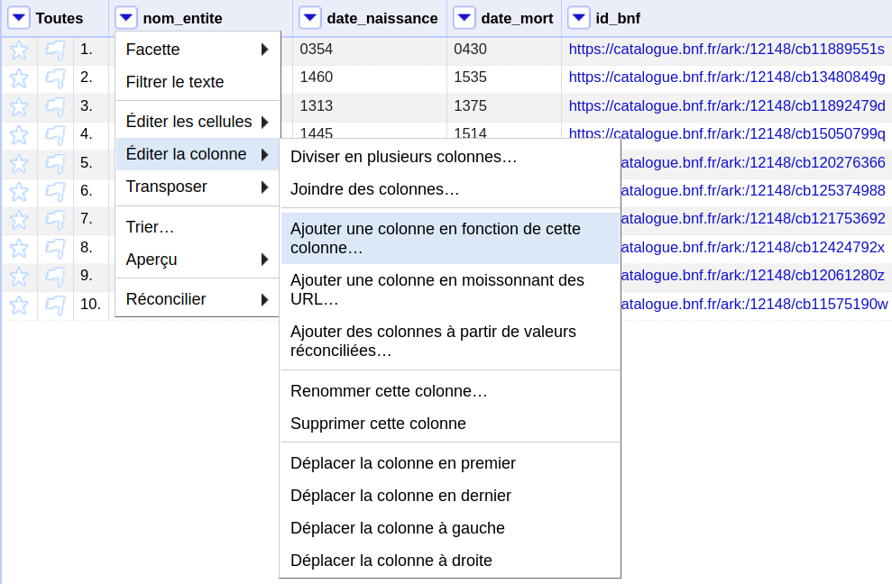
</figure>


## Étape 3 - Choisir un service de réconciliation

Cliquer sur la flèche de la nouvelle colonne, puis sélectionner « Réconcilier » et « Démarrer la réconciliation... ». Une fenêtre s’ouvre.

Par défaut, OpenRefine propose d’utiliser le service de réconciliation de Wikidata. Pour opérer une réconciliation avec les données des référentiels Biblissima, cliquer sur « Ajouter un service standard » en bas à gauche de la fenêtre, puis saisir l’URL suivante, correspondant à la **racine du webservice** : 

```
https://data.biblissima.fr/reconcile/fr/api
```

<figure markdown>
  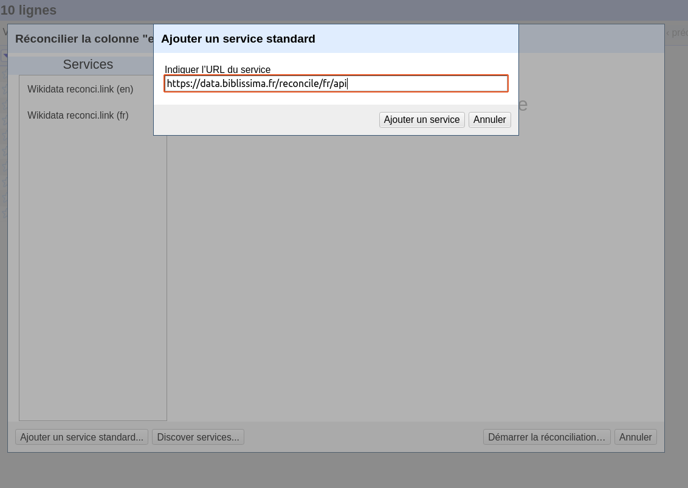
</figure>


## Étape 4 - Paramétrer la réconciliation

Choisir le **type d’entité** correspondant aux données à réconcilier. OpenRefine propose par défaut des types en fonction des données qui ont été chargées. 

Dans cet exemple, les types « être humain », « descripteur » et « œuvre » sont proposés par défaut, mais il est également possible de choisir un autre type d’entité en cochant « Réconcilier avec le type » et en indiquant le type voulu. Une autocomplétion est proposée.

Garder cochée la case « Correspondance automatique des valeurs candidates » permet la sélection automatique des propositions qui, pour une entité, seraient uniques et avec un score élevé.

D’autres paramètres peuvent également être configurés (se référer à la documentation d’OpenRefine).

Une fois les paramétrages effectués, appuyer sur « Démarrer la réconciliation... ». La réconciliation peut prendre plus ou moins de temps en fonction du volume de données à traiter.

<figure markdown>
  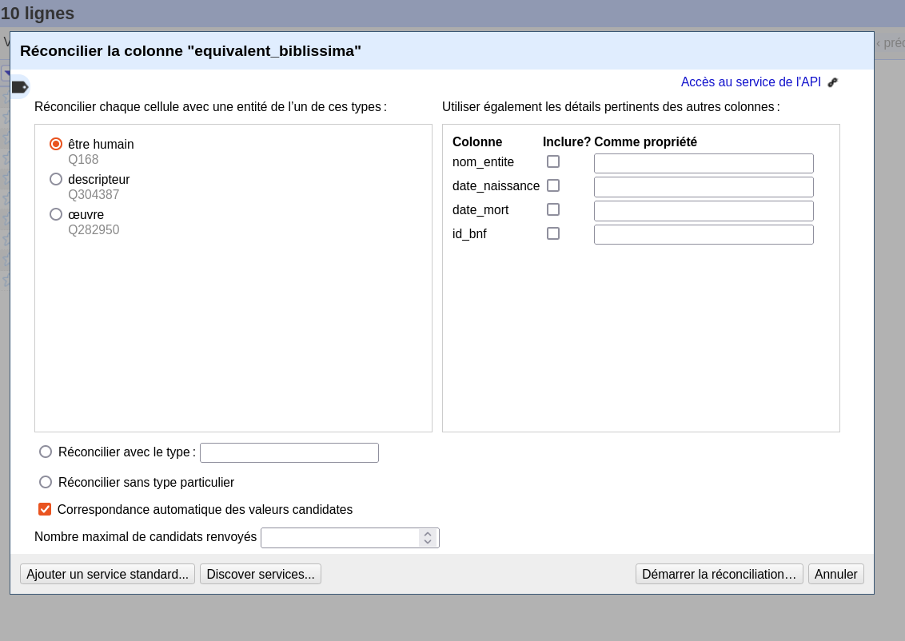
</figure>


## Étape 5 - Choisir parmi les propositions de réconciliation

Une fois le processus de réconciliation effectué, des propositions seront affichées pour chaque entité, s’il a été possible d’en déterminer. Il est indiqué pour chacune, entre parenthèses, un **score évaluant sa pertinence**, `100` étant le meilleur score. 

Des cases à cocher permettent de sélectionner l’entité retenue. Si la case « Correspondance automatique des valeurs candidates » a été cochée préalablement, certaines propositions ont pu être sélectionnées automatiquement, mais il est toujours possible de défaire ces choix.

Derrière chaque proposition se trouve un lien permettant d’afficher des informations liées à l’entité correspondante dans les référentiels, ce qui peut être utile pour vérifier ou comparer les propositions.

Il est possible qu’aucune proposition ne soit formulée pour une entité, en fonction de la proximité de vos données avec celles contenues dans les référentiels.

<figure markdown>
  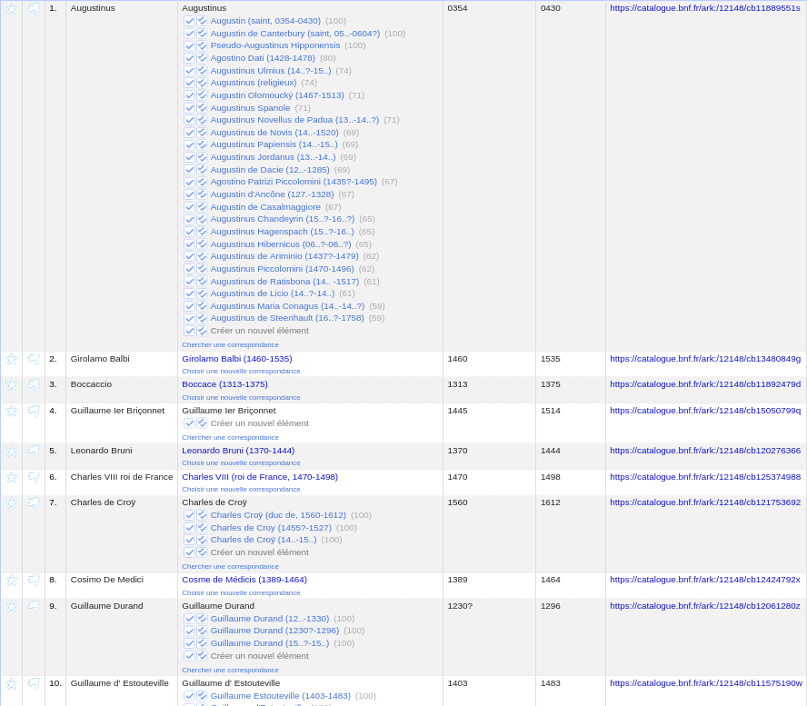
</figure>

Dans notre exemple, des résultats sont obtenus, mais ils sont moyennement satisfaisants. Pour plusieurs entités, des propositions multiples ont été renvoyées. Les comparer et sélectionner manuellement la correspondance qu’il convient de conserver peut être chronophage.

## Étape 6 - Améliorer les résultats de la réconciliation

Plusieurs stratégies peuvent être adoptées pour améliorer les résultats de la réconciliation. 

Il est ainsi possible d'apporter successivement quelques **modifications aux libellés des entités** en fonction de leur nature, puis de relancer le processus. Dans le cas des noms de personnes par exemple, on peut supprimer l'éventuel contenu des parenthèses (informations sur la date de naissance ou de mort, par exemple), les chiffres romains ou arabes utilisés pour désigner le rang, remplacer les caractères accentués par des non-accentués, les ligatures œ ou æ par les voyelles indépendantes. Pour les formes latines, il peut être utile de remplacer les « i » par des « j ». 

Par ailleurs, si dans les données qu'on souhaite aligner on dispose d'**informations supplémentaires** comme la date de naissance, de mort, ou des alignements vers d'autres référentiels, on peut les prendre en compte dans le processus de réconciliation en veillant à formater ces informations selon les choix opérés par le référentiel interrogé. 

Dans notre exemple, on voit que certaines dates de naissance sont suivies d'un point d'interrogation ou que les dates avant l'an mil sont précédées d'un 0. En regardant des exemples d'entités associées dans le référentiel Biblissima à la propriété P57 (date de naissance), on constate que les points d'interrogation sont transformés en un qualificatif d'incertitude et que les dates avant l'an mil sont exprimées sans utiliser de 0. 

De la même façon, dans le cas des identifiants externes, il convient d'identifier la manière dont sont formatées les URLs dans le référentiel Biblissima. Dans notre exemple, les URLs du fichier d'autorité de la BnF correspondent à la propriété P109 du référentiel Biblissima, qui retient comme identifiant uniquement le nom ARK sans le préfixe `cb` (pour plus de détails concernant la syntaxe des identifiants ARK de la BnF, voir Bertrand Caron, « L'identifiant ARK (Archival Resource Key) », [https://www.bnf.fr/fr/lidentifiant-ark-archival-resource-key](https://www.bnf.fr/fr/lidentifiant-ark-archival-resource-key)).

Pour améliorer les correspondances proposées pour l’échantillon, nous pouvons donc faire quelques modifications dans les données sources. 

Avant de relancer le processus de réconciliation, on pourra par exemple, de préférence en dupliquant les colonnes, supprimer les 0 et les ? de la colonne date_naissance. Pour ce faire, sélectionner, dans le menu déroulant de la colonne correspondante, “Éditer les cellules” puis “Transformer…”. Saisir ensuite l’**expression GREL** (General Refine Expression Language ; voir la [documentation d'OpenRefine sur les expressions](https://openrefine.org/docs/manual/expressions)) suivante : 

```
value.replace(/^0|\?/,"")
```

<figure markdown>
  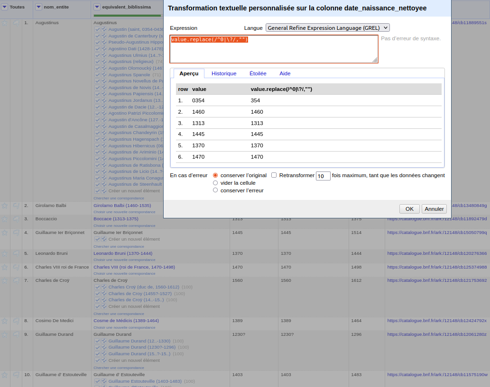
</figure>


De même, on pourra supprimer la partie d'url « https://catalogue.bnf.fr/ark:/12148/cb » de la colonne `id_bnf`, afin de conserver uniquement l’identifiant BnF en tant que tel. Pour ce faire, l’expression GREL suivante peut être utilisée : 

```
value.replace("https://catalogue.bnf.fr/ark:/12148/cb","")
```

<figure markdown>
  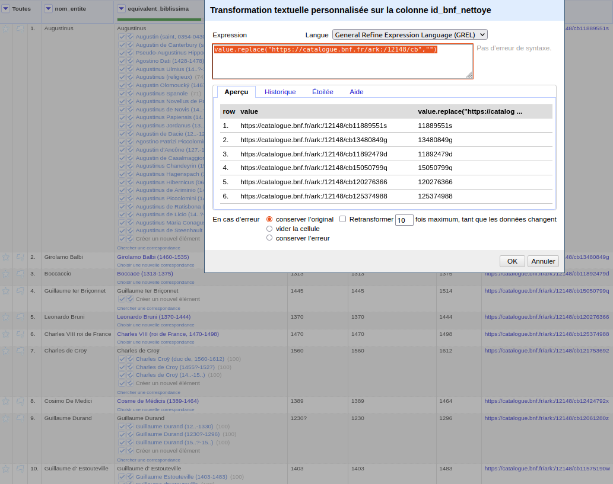
</figure>


Lors du lancement de la réconciliation, on peut cocher dans la partie droite de la fenêtre les colonnes nettoyées, en indiquant les **propriétés équivalentes dans le référentiel Biblissima**, à savoir P57 et P109. 

<figure markdown>
  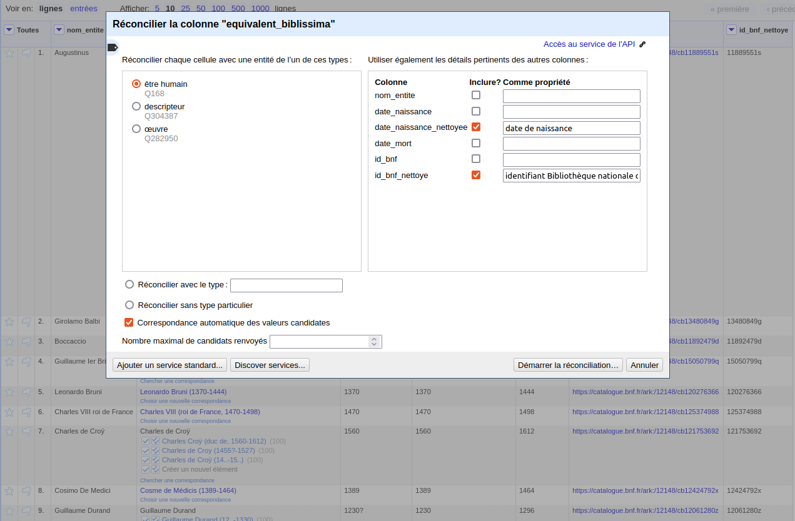
</figure>

Une fois le processus terminé, on constate que les résultats sont grandement améliorés. 

<figure markdown>
  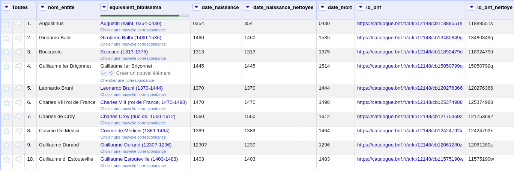
</figure>

Néanmoins, pour un libellé (« Guillaume Ier Briçonnet ») il n'y a aucun candidat proposé. On peut modifier le libellé en supprimant le chiffre « Ier » et essayer à nouveau la réconciliation.

<figure markdown>
  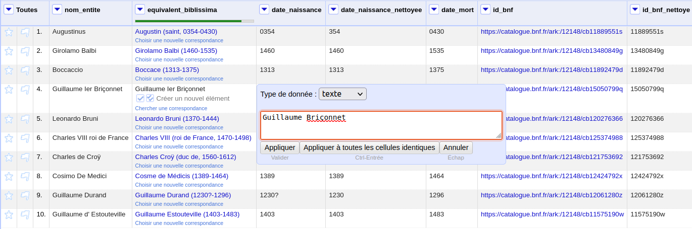
</figure>

Une correspondance est alors trouvée.

<figure markdown>
  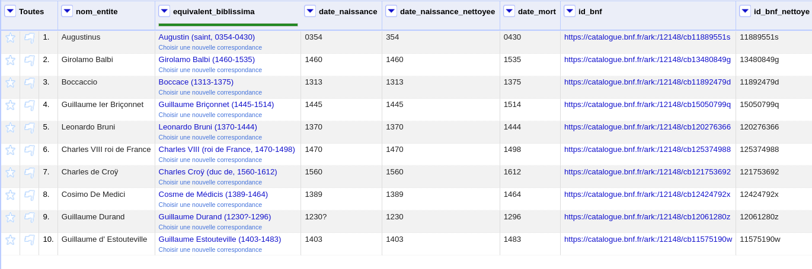
</figure>


## Étape 7  - Enrichir les données

Une fois la réconciliation effectuée, il peut être bienvenu de récupérer des données issues des référentiels, afin d’**enrichir les données sources**.

Il est par exemple possible de créer une nouvelle colonne contenant les identifiants des référentiels Biblissima pour chacune des entités. 
Pour ce faire, cliquer sur la flèche de la colonne contenant les données réconciliées, puis sélectionner « Éditer la colonne » et « Ajouter des colonnes en fonction des données réconciliées... ». Une fenêtre s’ouvre. La propriété « Qid » est suggérée et peut être choisie.

D’autres propriétés peuvent également être sélectionnées, par exemple l’« identifiant CERL » (P117). Pour ajouter d'autres valeurs, il suffit de renseigner successivement l'autres propriétés dans la case « Ajouter une propriété ».

<figure markdown>
  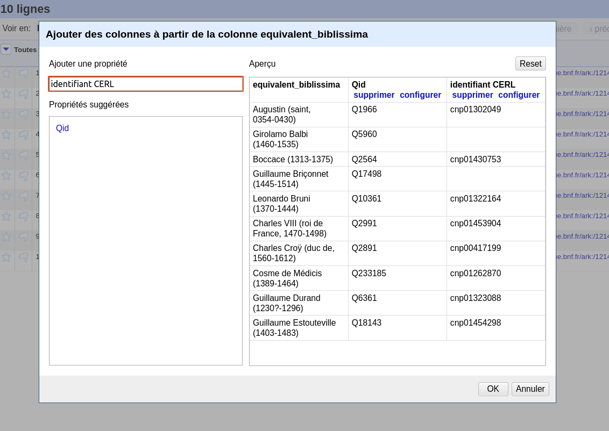
</figure>

De nouvelles colonnes sont alors créées.

<figure markdown>
  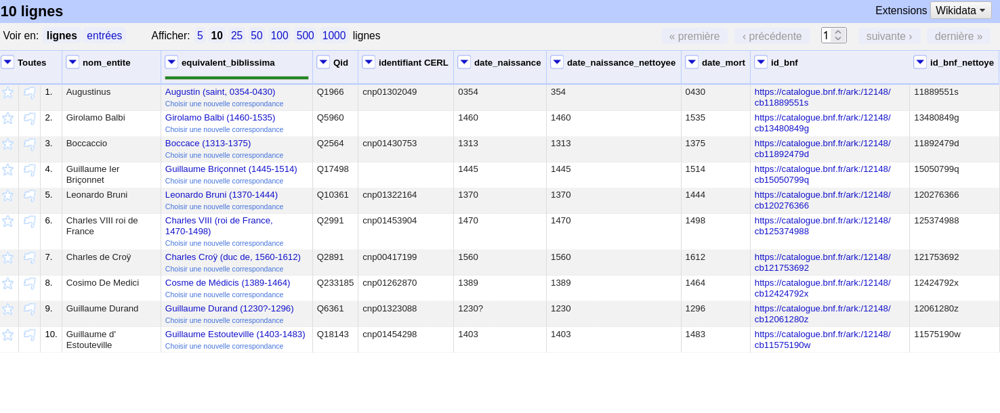
</figure>

## Étape 8 - Exporter les données

Les données réconciliées, et éventuellement enrichies, peuvent finalement être **exportées dans une variété de formats** via le bouton « Exporter », en haut à droite.

<figure markdown>
  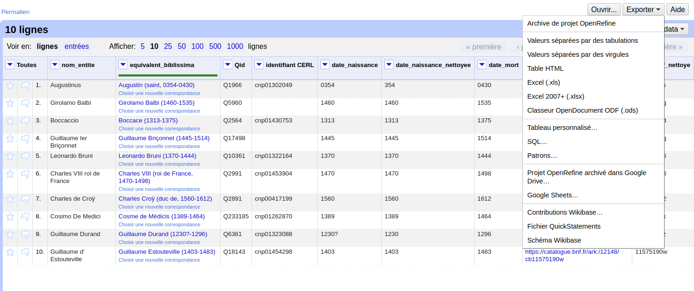
</figure>

