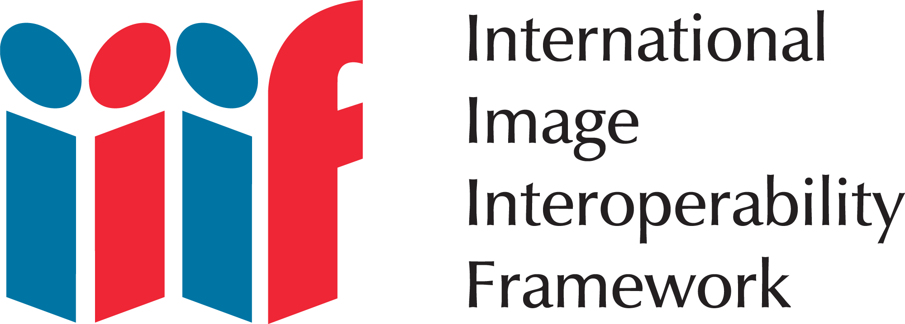

# IIIF

L'ÉquipEx **Biblissima** (2012-2021) - _Observatoire du patrimoine écrit du Moyen Âge et de la Renaissance (8e-18e s.)_ - a joué un rôle moteur dans la promotion et l'adoption des standards IIIF en France.

L'ÉquipEx+ **Biblissima+** (2021-2029) - _Observatoire des cultures écrites anciennes de l’argile à l’imprimé_ - poursuit cet effort de diffusion des standards et technologies IIIF, en particulier dans le cadre du [Cluster 1 – Acquisition des corpus de sources interopérables](https://projet.biblissima.fr/fr/projet/clusters-biblissima/cluster-1). L'ensemble de la documentation et jeux de données produits dans le cadre de ce cluster 1 sont déposés sur un [espace Zenodo dédié](https://zenodo.org/communities/biblissima-cluster1/?q=&l=list&p=1&s=10&sort=newest).

!!! tip "Pour en savoir plus"
    
    - sur [l'implication de Biblissima dans l'initiative internationale IIIF](https://iiif.biblissima.fr/#implication-biblissima)
    - sur [les implémentations de IIIF dans le portail Biblissima](../api/api-presentation.md)
    - sur [l'implémentation de IIIF dans plusieurs bibliothèques numériques en France](entrepots-iiif.md) situées dans le périmètre initial de Biblissima
    - sur [les standards IIIF de façon générale](introduction-iiif.md)

    Pour une plongée plus en profondeur dans l'écosystème de IIIF et le fonctionnement des protocoles, consulter le **[module de formation à IIIF](https://doc.biblissima.fr/formation-iiif/)**.

    Voir aussi toute la [documentation du cluster 1 de Biblissima+](https://zenodo.org/communities/biblissima-cluster1/?q=&l=list&p=1&s=10&sort=newest) sur Zenodo.

<figure markdown>
  { width="400" }
</figure>
