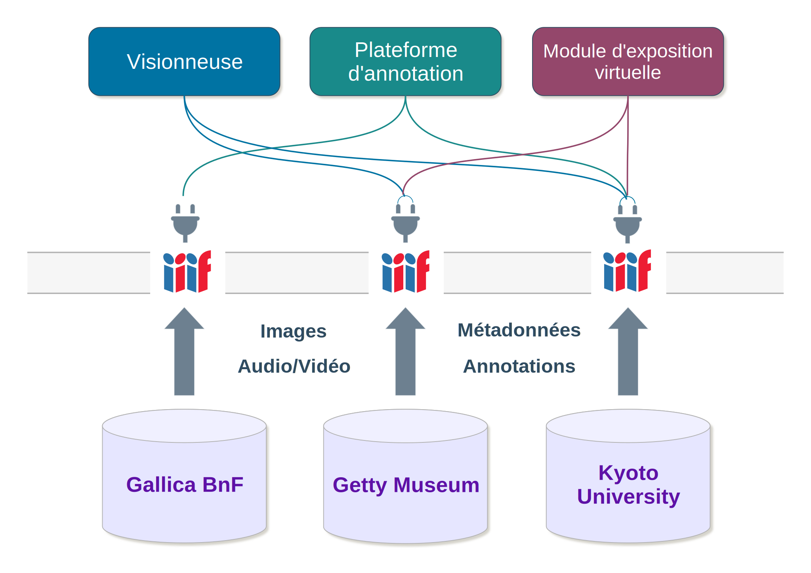
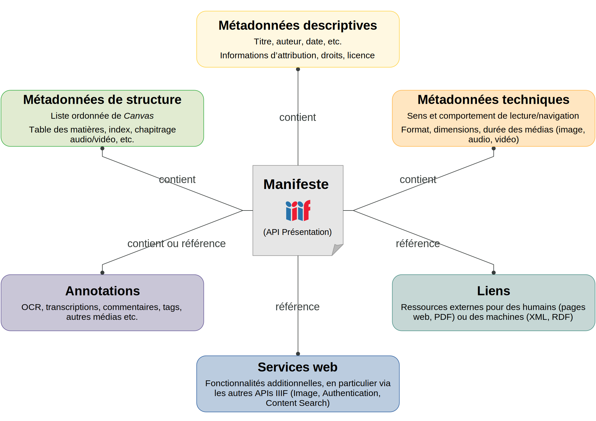
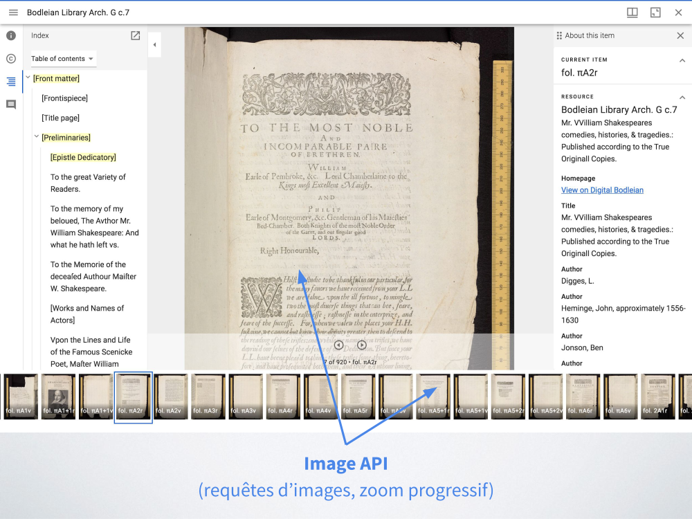
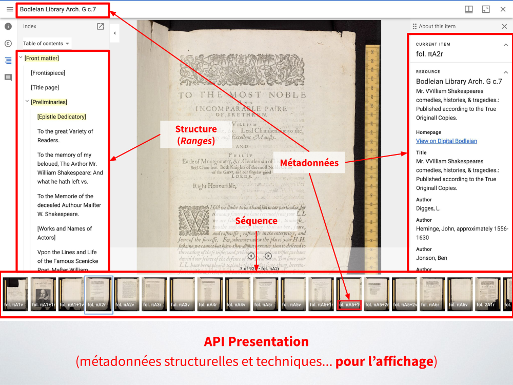

---
hide:
  - navigation
---

# Introduction à IIIF

IIIF – _International Image Interoperability Framework™_ – désigne à la fois une **communauté** et un **cadre d’interopérabilité** pour diffuser, présenter et annoter des images et documents audio/vidéo sur le Web. Il s’est imposé en quelques années comme un standard et une brique technologique essentielle pour décloisonner les collections numérisées des institutions patrimoniales à l’échelle mondiale.

## Constat

La raison d'être de l'initiative IIIF se fonde sur un constat général de manque d'interopérabilité entre bibliothèques et entrepôts d'images numériques disponibles sur le Web :

- chaque entrepôt a été conçu comme un silo : les images ne sont visualisables et manipulables que dans l'emprise du site qui les met à disposition ;
- chaque application est unique : les institutions ont développé leur propre visualiseur et défini leurs propres méthodes de diffusion de leurs images en ligne ;
- l’utilisateur doit s'adapter à chaque environnement : il doit composer avec des interfaces de consultation différentes, ayant chacune ses fonctionnalités propres, sans passerelle possible.

Dans un contexte de numérisation de masse et de multiplication de l’accès aux sources en ligne, les pratiques numériques des chercheurs deviennent de plus en plus sophistiquées et cherchent à s’affranchir des barrières techniques entre les sites : 

- pour mettre côte à côte plusieurs documents numérisés issus de bibliothèques différentes afin de les comparer ou de les annoter ; 
- pour restituer l’état originel d’un document en regroupant virtuellement des fragments dispersés ; 
- pour associer aux images des données produites par la recherche, telles que des transcriptions, des commentaires, du son, d’autres images.


## Vision

L'ambition de IIIF est de créer un cadre technique commun grâce auquel les fournisseurs de ressources numériques (image, son, vidéo) peuvent :

- délivrer leurs contenus de manière standardisée sur le Web,
- afin de les rendre consultables, manipulables et annotables,
- par n’importe quel logiciel compatible.

<figure markdown>
  
  <figcaption>Schéma : principe général d’interopérabilité de IIIF (trois applications différentes sont branchées à trois entrepôts IIIF). <a href="/assets/schema_iiif.svg">Agrandir l'image</a></figcaption>
</figure>

Dans cet environnement distribué et interopérable, chaque entrepôt devient un point d'accès distant potentiel auquel des applications tierces peuvent se "brancher" et réutiliser les ressources à d'autres fins, sans avoir à les dupliquer et sans en perdre le contexte.

En rendant accessibles de vastes corpus d’images et de ressources audiovisuelles, IIIF agit comme un facilitateur pour de nombreux projets et applications utilisant les collections des institutions culturelles et susceptibles de toucher des publics variés : portails thématiques, expositions virtuelles, plateformes de _crowdsourcing_, événements de type hackathon, constitution de corpus de recherche, reconstitutions virtuelles, etc.


## Communauté IIIF

Formée au tournant des années 2010 autour d’un petit noyau de bibliothèques nationales et universitaires, l’initiative IIIF est aujourd’hui portée par un [consortium international](https://iiif.io/community/consortium/) d’une soixantaine d’organisations et animée par une communauté d’acteurs très divers : musées, archives, bibliothèques, instituts de recherche, sociétés de services informatiques.

Le rôle principal de la communauté IIIF est d’élaborer, de publier et de faire évoluer de façon concertée les spécifications techniques de IIIF à partir de cas d’usages réels et documentés.

Ces spécifications sont ensuite implémentées dans des logiciels et plateformes de diverses natures (serveurs d’images, visualiseurs, outils d’annotation, systèmes de gestion de contenus, etc.), garantissant ainsi leur interopérabilité.

!!! tip ""
    - Voir la [carte de la communauté IIIF](https://iiif.io/community/map/)
    - Voir la [liste officielle de ressources et outils IIIF](https://github.com/IIIF/awesome-iiif/)


## Avantages de IIIF pour les institutions

**En termes de diffusion et valorisation des collections**, IIIF permet de proposer aux internautes des fonctionnalités avancées et une expérience enrichie, notamment pour :

- Visualiser et zoomer sur des images en haute résolution de manière plus fluide et performante.
- Appeler et manipuler une image à distance afin de modifier sa taille, lui appliquer une rotation, changer son format etc.
- Citer et partager une image ou une région d'intérêt au moyen d'une URL stable.
- Comparer des ressources provenant d'institutions différentes, tout en conservant les métadonnées nécessaires à la compréhension de leur contexte respectif.
- Annoter les ressources de façon standard (modèle [Web Annotation Data Model](https://www.w3.org/TR/annotation-model/) du W3C) avec du texte ou d'autres médias.
- Rechercher en plein-texte dans les annotations associées à un document (commentaires, transcriptions, OCR etc.).
- Combiner et remixer des ressources issues de plusieurs entrepôts afin de reconstituer virtuellement un objet ou une collection dispersée, créer un _mash-up_ associant image, texte, son ou vidéo.

**En termes de développement et de maintenance informatique**, l'écosystème de IIIF :

- Dispose d'un large panel de logiciels compatibles avec ses API, tant côté serveur que côté client.
- Offre ainsi plus de souplesse dans la migration de logiciels, la couche serveur étant découplée de la couche cliente :
    - ce qui facilite le changement de serveur d’images sans avoir à adapter les applications clientes, et vice versa ;
    - et réduit la dépendance à un logiciel ou un prestataire informatique en particulier.
- Permet de réduire les coûts globaux sur le long terme :
    - beaucoup de logiciels sont développés de façon communautaire et distribués sous licence libre ;
    - le développement peut être rationalisé grâce à l’utilisation de composants réutilisables et partagés entre applications.
- Facilite le transfert et le partage de données : IIIF est entièrement basé sur les standards et l’architecture du Web (principes REST et du _Linked Data_, modèle _Web Annotation_, JSON-LD).
- Permet de publier ses ressources une fois et de les réutiliser autant que souhaité.
- Prend en charge les contraintes institutionnelles liées à l’authentification et aux droits
d’accès (_IIIF Authentication API_).


## Technologie (API IIIF)

Le cadre technique défini par IIIF repose sur plusieurs protocoles ou « API » (interface de programmation applicative). Ils forment le socle commun sur lequel un écosystème d’outils et de ressources numériques interopérables peut se développer.

Les deux principales API sont :

- **l'API Image**
- **l'API Présentation**

D'autres API fonctionnant de manière conjointe et complémentaire à ces deux dernières sont actuellement publiées en version stable : voir la [liste complète des API IIIF disponibles](https://iiif.io/api/).


### API Image

L'API Image spécifie une méthode pour délivrer les pixels d’une image et la manipuler à distance à travers une syntaxe d’URL standardisée.

Cette syntaxe d'URL s'applique à deux types de requêtes sur une même image :

- **requête de l'image elle-même** (pixels)
- **requête d'information sur l'image** (JSON)

#### Requête d'image

``` title="Modèle d'URL"
{scheme}://{server}{/prefix}/{identifier}/{region}/{size}/{rotation}/{quality}.{format}
```

``` title="Exemple (image pleine taille)"
https://example.org/image-service/abcd1234/full/full/0/default.jpg (API Image 2.1)
https://example.org/image-service/abcd1234/full/max/0/default.jpg (API Image 3.0)
```

Ce mécanisme d'URL permet à un client d'appeler et manipuler une image selon des paramètres de région (`region`), de taille (`size`), de rotation (`rotation`), de qualité (`quality`) et de format (`format`). Par exemple il est possible de demander la version pleine taille d'une image, ou simplement une portion de celle-ci (zone d'intérêt au sein de l'image), de la redimensionner, de la faire pivoter ou la retourner horizontalement ou verticalement, de la passer en noir et blanc, etc.

NB : le paramètre `identifier` ("abcd1234") est l'identifiant unique de l'image dans l'entrepôt source. Il peut s'agir d'un ARK, un URN, un simple nom de fichier, ou tout autre type d'identifiant. Les caractères spéciaux doivent être encodés. Le paramètre `/prefix` ("/image-service") est optionnel.

!!! example "Exemples"
    Tester le [Image API Playground](https://www.learniiif.org/image-api/playground) pour jouer avec les différents paramètres de l'API.

    Exemples d'URL (API Image 2.1) :

    - [https://api.digitale-sammlungen.de/iiif/image/v2/bsb00021200_00038/full/562,800/0/default.jpg](https://api.digitale-sammlungen.de/iiif/image/v2/bsb00021200_00038/full/562,800/0/default.jpg) (image entière, retaillée à 562x800 pixels)
    - [https://api.digitale-sammlungen.de/iiif/image/v2/bsb00021200_00038/654,2223,2996,2200/800,/0/default.jpg](https://api.digitale-sammlungen.de/iiif/image/v2/bsb00021200_00038/654,2223,2996,2200/800,/0/default.jpg) (région d'intérêt au sein de l'image, retaillée à 800 pixels de largeur)
    - [https://api.digitale-sammlungen.de/iiif/image/v2/bsb00021200_00038/654,2223,2996,2200/600,/!0/gray.png](https://api.digitale-sammlungen.de/iiif/image/v2/bsb00021200_00038/654,2223,2996,2200/600,/!0/gray.png) (région d'intérêt retaillée à 600 pixels de largeur, retournée sur l'axe vertical, passée en niveau de gris et au format PNG)

#### Requête d'information sur l'image

``` title="Modèle d'URL"
{scheme}://{server}{/prefix}/{identifier}/info.json
```

``` title="Exemple"
https://example.org/image-service/abcd1234/info.json
```

Ce type de requête permet de fournir des métadonnées techniques sur une image, utilisables par une application cliente (visualiseur ou autre logiciel) sous la forme de données au format JSON.

Ces métadonnées techniques sur l’image comprennent notamment :

- les dimensions de l’image
- tailles préférées du serveur qui délivre l'image
- les dimensions des tuiles d'image le cas échéant (utilisées pour le zoom)
- des informations de conformité : version de l’API supportée par le serveur, niveau de compatibilité avec l'API Image, autres fonctionnalités supportées
- mentions de droits ou de licence

!!! example "Exemples"

    - [https://iiif.library.ucla.edu/iiif/2/ark%3A%2F21198%2Fzz00090nmj/info.json](https://iiif.library.ucla.edu/iiif/2/ark%3A%2F21198%2Fzz00090nmj/info.json) (API Image 2.1)
    - [https://iiif.io/api/image/3.0/example/reference/59d09e6773341f28ea166e9f3c1e674f-gallica_ark_12148_bpt6k1526005v_f19/info.json](https://iiif.io/api/image/3.0/example/reference/59d09e6773341f28ea166e9f3c1e674f-gallica_ark_12148_bpt6k1526005v_f19/info.json) (API Image 3.0)

#### Implémentation

!!! abstract "Notes"

    - Une implémentation dynamique passe par l'installation et le paramétrage d'un serveur d'images IIIF (voir la [liste des logiciels existants](https://github.com/IIIF/awesome-iiif/#image-servers)). Cela permet de bénéficier des principales fonctionnalités de l'API Image (level 1 ou 2).
    - Une implémentation statique est une alternative possible à l'installation d'un logiciel dédié, qui consiste à pré-générer des tuiles d'images (level 0 de l'API Image) et de les délivrer via un serveur Web classique. NB : cela limite les possibilités de manipulation dynamique de l'image, avec ce type d'implémentation il n'est par exemple pas possible de citer une région arbitraire au sein d'une image.
    - Pour les images en hauté résolution, il est conseillé d'opter pour un format optimisé pour le zoom progressif : JPEG2000 ou TIFF Pyramidal.
    - Il convient de respecter certains [pré-requis techniques](../vademecum-biblissima.md#pre-requis-techniques-du-serveur-iiif) dans la configuration du serveur (protocole HTTPS et entêtes HTTP CORS).


### API Présentation

#### Principe

L’API Présentation spécifie les **métadonnées (descriptives, structurelles, techniques) nécessaires à la présentation d’un objet numérique** dans une interface (par exemple un visualiseur d'images, ou tout autre environnement manipulant des images et autres médias supportés par IIIF).

Toutes ces informations sont contenues dans un fichier appelé **« Manifeste »**, une sorte d’enveloppe virtuelle formant l’unité de distribution élémentaire dans l’univers IIIF. C’est en général ce fichier que vont manipuler les logiciels pour interagir avec une ressource, la visualiser, ou la transférer vers un autre outil.

L’API Présentation constitue à la fois :

- un **format d’échange**, sérialisé en [JSON-LD](https://json-ld.org)
- un **modèle décrivant la représentation numérique d’un objet** : la séquence ordonnée des médias qui le compose (images, audios, vidéos), sa structure interne, ses métadonnées, ses liens avec d’autres ressources, ses annotations.

Un Manifeste IIIF représente le plus souvent le fac-similé numérique d’un objet physique (livre, manuscrit, périodique, carte, peinture, photographie, partition, monnaie, objet archéologique, archive sonore, captation vidéo, etc.). Mais un Manifeste peut tout aussi bien représenter un objet virtuel et composite constitué d'une série d'images ou autres médias rassemblés à des fins scientifiques ou pédagogiques, et pouvant provenir de différentes collections.

<figure markdown>
  
  <figcaption>Schéma : principales composantes d'un Manifeste IIIF. <a href="/assets/schema_manifeste_iiif.svg">Agrandir l'image</a></figcaption>
</figure>

Les visualiseurs IIIF tels que [Mirador](https://projectmirador.org) ou [Universal Viewer](http://universalviewer.io/) font partie des outils capables d'afficher un objet via son Manifeste et de proposer à l'utilisateur une expérience de visualisation riche.

Les deux images ci-dessous permettent d'illustrer où sont mobilisées les deux API Image et Présentation dans un visualiseur comme Mirador 3 :





#### Exemples (1)

!!! example "Manifestes : exemples par type d'institution"

    Archives :

    - Dublin City Library and Archive : _Royal charters to the city of Dublin_ ([Manifeste JSON](https://by2022.adaptcentre.ie/iiif/v1/160821/manifest) -- [Ouvrir dans Mirador](https://portail.biblissima.fr/m3/?theme=dark&context=collection&iiif-content=https://by2022.adaptcentre.ie/iiif/v1/160821/manifest))
    - Archives départementales de la Vienne : _La Nouvelle République du Centre-Ouest : 8 septembre 1944-30 décembre 1945_ ([Manifeste JSON](https://archives-deux-sevres-vienne.fr/ark:/28387/vta563c56f414a055ae/manifest) -- [Ouvrir dans Mirador](https://portail.biblissima.fr/m3/?theme=dark&context=collection&iiif-content=https://archives-deux-sevres-vienne.fr/ark:/28387/vta563c56f414a055ae/manifest))
    - Archives fédérales suisses : _Procès-verbal(-aux) des décisions 08.05.1945_ ([Manifeste JSON](https://api.chgov.bar.admin.ch/manifests/32328752/32328752.json) -- [Ouvrir dans Mirador](https://portail.biblissima.fr/m3/?theme=dark&context=collection&iiif-content=https://api.chgov.bar.admin.ch/manifests/32328752/32328752.json))

    Bibliothèques :

    - Bibliothèque Mazarine : _La Bible de Gutenberg_ ([Manifeste JSON](https://mazarinum.bibliotheque-mazarine.fr/iiif/1703/manifest) -- [Ouvrir dans Mirador](https://portail.biblissima.fr/m3/?theme=dark&context=collection&iiif-content=https://mazarinum.bibliotheque-mazarine.fr/iiif/1703/manifest))
    - Ghent University Library : _[map] Gent_ ([Manifeste JSON](https://adore.ugent.be/IIIF/manifests/archive.ugent.be:8ED9BD60-2689-11E6-BB79-D668D43445F2) -- [Ouvrir dans Mirador](https://portail.biblissima.fr/m3/?theme=dark&context=collection&iiif-content=https://adore.ugent.be/IIIF/manifests/archive.ugent.be:8ED9BD60-2689-11E6-BB79-D668D43445F2))
    - Bayerische Staatsbibliothek : _Logbook of a Ship of Sir Francis Drake’s Last Voyage_ ([Manifeste JSON](https://api.digitale-sammlungen.de/iiif/presentation/v2/bsb00110131/manifest) -- [Ouvrir dans Mirador](https://portail.biblissima.fr/m3/?theme=dark&context=collection&iiif-content=https://api.digitale-sammlungen.de/iiif/presentation/v2/bsb00110131/manifest))

    Musées :

    - Getty Museum : _Irises_ ([Manifeste JSON](https://media.getty.edu/iiif/manifest/53be857e-41e8-4198-b45d-2e0f52d3051b) -- [Ouvrir dans Mirador](https://portail.biblissima.fr/m3/?theme=dark&context=collection&iiif-content=https://media.getty.edu/iiif/manifest/53be857e-41e8-4198-b45d-2e0f52d3051b))
    - Statens Museum for Kunst : _View of the Interior of the Colosseum_ ([Manifeste JSON](https://api.smk.dk/api/v1/iiif/manifest/?id=KMS1776) -- [Ouvrir dans Mirador](https://portail.biblissima.fr/m3/?theme=dark&context=collection&iiif-content=https://api.smk.dk/api/v1/iiif/manifest/?id=KMS1776))
    - The Royal Collection Trust : _Raphael Collection portfolio 26_ ([Manifeste JSON](https://rct.resourcespace.com/iiif/970585/) -- [Ouvrir dans Mirador](https://portail.biblissima.fr/m3/?theme=dark&context=collection&iiif-content=https://rct.resourcespace.com/iiif/970585/))


#### Exemples (2)

!!! example "Manifestes : exemples avancés"

    - Biblissima - Reconstruction virtuelle (partielle) d'un manuscrit mutilé (Châteauroux, BM, ms. 5) : [Manifeste JSON (v2)](https://demos.biblissima.fr/iiif/metadata/BVMM/chateauroux/manifest.json) -- [Ouvrir dans Mirador](https://portail.biblissima.fr/m3/?theme=dark&context=collection&iiif-content=https://demos.biblissima.fr/iiif/metadata/BVMM/chateauroux/manifest.json)

    - Biblissima - Reconstruction virtuelle d'un manuscrit dispersé (« Florus dispersus ») : [Manifeste JSON (v2)](https://demos.biblissima.fr/iiif/metadata/florus-dispersus/manifest.json) -- [Ouvrir dans Mirador](https://portail.biblissima.fr/m3/?theme=dark&context=collection&iiif-content=https://demos.biblissima.fr/iiif/metadata/florus-dispersus/manifest.json)

    - Biblissima - Collection d'enluminures portant une représentation de comètes : [Manifeste JSON (v2)](https://portail.biblissima.fr/iiif/manifest/ark:/43093/descdbf571c2dcac868496312bf36d449401e4ac0af4) -- [Ouvrir dans Mirador](https://portail.biblissima.fr/m3/?theme=dark&context=collection&iiif-content=https://portail.biblissima.fr/iiif/manifest/ark:/43093/descdbf571c2dcac868496312bf36d449401e4ac0af4)

    - Biblissima - Collection d'enluminures issue d'une requête combinant les termes « Planète » et « Cosmographie » : [Manifeste JSON (v2)](https://portail.biblissima.fr/iiif/manifest?descriptors=AND|569c70bc8f3f52b8966895b97ace86644dca444a,AND|86e65567ec9ac97ea2404af46cafa34d6f4920e7) -- [Ouvrir dans Mirador](https://portail.biblissima.fr/m3/?theme=dark&context=collection&iiif-content=https://portail.biblissima.fr/iiif/manifest?descriptors=AND|569c70bc8f3f52b8966895b97ace86644dca444a,AND|86e65567ec9ac97ea2404af46cafa34d6f4920e7)

    - Library of Congress - Lettre numérisée par imagerie hyperspectrale, avec affichage de la transcription du texte et des différentes couches d'image : [Manifeste JSON (v2)](https://dvp.prtd.app/hamilton/manifest.json) -- [Ouvrir dans Mirador](https://portail.biblissima.fr/m3/?theme=dark&context=collection&iiif-content=https://dvp.prtd.app/hamilton/manifest.json)

    - Bayerische Staatsbibliothek, Munich - Livre imprimé, avec service de recherche plein-texte au sein de l'OCR [Manifeste JSON (v2)](https://api.digitale-sammlungen.de/iiif/presentation/v2/bsb10139933/manifest) || [Ouvrir dans Mirador](https://portail.biblissima.fr/m3/?theme=dark&context=collection&iiif-content=https://api.digitale-sammlungen.de/iiif/presentation/v2/bsb10139933/manifest)

    - Bodleian Library, Oxford - Manuscrit arabe illustré, portant de nombreuses annotations IIIF de formes diverses (voir fols. 2b and 3a) : [Manifeste JSON (v2)](https://iiif.bodleian.ox.ac.uk/iiif/manifest/748a9d50-5a3a-440e-ab9d-567dd68b6abb.json) -- [Ouvrir dans Mirador](https://portail.biblissima.fr/m3/?theme=dark&context=collection&iiif-content=https://iiif.bodleian.ox.ac.uk/iiif/manifest/748a9d50-5a3a-440e-ab9d-567dd68b6abb.json)

    - Biblioteca Vaticana - Manuscrit hébreu, avec lecture de droite à gauche : [Manifeste JSON (v2)](https://digi.vatlib.it/iiif/MSS_Vat.ebr.327/manifest.json) -- [Ouvrir dans Mirador](https://portail.biblissima.fr/m3/?theme=dark&context=collection&iiif-content=https://digi.vatlib.it/iiif/MSS_Vat.ebr.327/manifest.json)

    De nombreux exemples de Manifestes sont aussi accessibles sur ces deux pages :

    - [IIIF Cookbook](https://iiif.io/api/cookbook)
    - [Mirador 3 Fixtures & sample IIIF data](https://github.com/ProjectMirador/mirador/wiki/M3-Fixtures-&-sample-IIIF-data)


#### Implémentation

!!! abstract "Notes"

    - Un Manifeste IIIF peut être créé de façon statique ou dynamique.
    - La production d'un Manifeste est souvent une opération spécifique à un environnement institutionnel ou informatique donné : il n'y a pas de méthode unique universellement applicable.
    - Un Manifeste résulte dans la plupart des cas de la combinaison de deux types d'informations (qui peuvent potentiellement provenir de systèmes différents) : 
        - un ensemble de métadonnées descriptives ;
        - des informations de séquence et de structure de l'objet numérique (en premier lieu la liste ordonnée des images qui le constitue, avec leurs identifiants et leurs dimensions en pixels).
    - Ces données nécessaires à la génération d'un Manifeste peuvent être structurées dans différents formats source (METS/MODS, XML-TEI, XML-EAD, tableur type CSV, base de données etc.).
    - L'API Présentation est le plus souvent utilisée de façon conjointe avec l'API Image pour gérer le zoom et l'affichage des différents dérivés d'une image (vignette, aperçu). Dans ce cas la génération d'un Manifeste implique d'être capable d'établir le lien entre une vue au sein de l'objet (par exemple une page de livre) et le service API Image de l'image correspondante.
    - Il est conseillé de vérifier la conformité des Manifestes en utilisant le [validateur officiel](https://presentation-validator.iiif.io/).
    - Il convient de respecter de certains [pré-requis techniques](../vademecum-biblissima.md#pre-requis-techniques-du-serveur-iiif) dans la configuration du serveur qui expose les Manifests (protocole HTTPS et entêtes HTTP CORS).


## Pour approfondir

**Quelques ressources utiles en français :**

- [Intégrer IIIF dans le projet de refonte du site web de votre service d'archives : éléments pour CCTP et cadre de réponse](https://zenodo.org/doi/10.5281/zenodo.8380226) (Cécile Sajdak, 2023)
- [Module de formation à IIIF (1 jour)](https://doc.biblissima.fr/formation-iiif/) (Régis Robineau). Site support de la formation organisée en novembre 2022 et novembre 2023 au Campus Condorcet dans le cadre du cluster 1 de Biblissima+
- [IIIF : découverte et interopérabilité sans frontières des images patrimoniales](https://www.culture.gouv.fr/fr/Thematiques/Enseignement-superieur-et-Recherche/La-revue-Culture-et-Recherche/La-recherche-culturelle-a-l-international), _Culture et Recherche_ n°143, 2022, p. 111-117
- [Vidéo de la session régionale IIIF France](https://projet.biblissima.fr/fr/formations-evenements/conference-iiif-2021-session-regionale-iiif-france) de la Conférence internationale IIIF 2021 (24 juin 2021).
- [Vidéos et supports de présentations du séminaire IIIF360](https://projet.biblissima.fr/fr/evenements/rendez-vous-iiif360-2021) (24 mars 2021).
- [Visualisation et fouille des données : IIIF](https://github.com/regisrob/Atelier_IIIF_TD_Master_CESR_2020) (Régis Robineau). Cours de Master 2 « Mediation Numérique de la Culture et des Patrimoines » (École Supérieure en Intelligence des Patrimoines, CESR, Université de Tours)
- [Adopter et utiliser les standards IIIF pour vos corpus d'images numériques](https://github.com/regisrob/Atelier_IIIF_Conference_DHNord_2020) (Régis Robineau). Atelier en ligne organisé dans le cadre du colloque « #dhnord2020 - La mesure des images : approches computationnelles en histoire et théorie des arts » (MESHS, 18 novembre 2020)
- [Introduction aux protocoles IIIF](https://doi.org/10.5281/zenodo.3760306) (Régis Robineau, 2019). Présentation faite dans le cadre de la formation au Diplôme de conservateur de bibliothèque de l'Enssib (Villeurbanne, 23 janvier 2019)

**En anglais :**

- [Get Started — IIIF](https://iiif.io/get-started/)
- [Cookbook of IIIF Recipes](https://iiif.io/get-started/cookbook/)
- [Awesome IIIF](https://github.com/IIIF/awesome-iiif) (liste de ressources utiles maintenue par la communauté IIIF)
- [Chaîne Youtube IIIF](https://www.youtube.com/channel/UClcQIkLdYra7ZnOmMJnC5OA)
